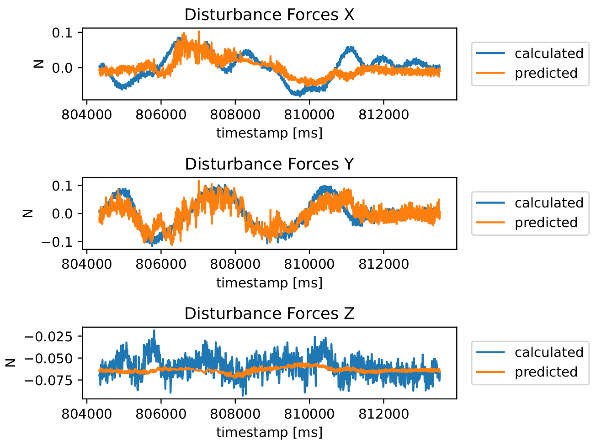
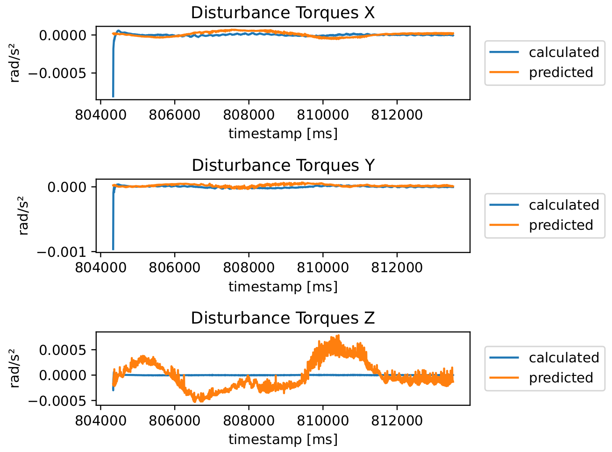

Meetings:

03.02-09.02:

progress:
- supervised learning:
    - plot the test data
    - test lr: 0.0001 in comparison to lr: 0.003
    - test MAE in comparison to MSE

- decision tree:
    - 

26.01-02.02:

progress
- plot the different plots of the model
- read the docs about xgboost
- start implementing decision tree
- write on thesis

20.01-25.01:

progress:
-read papers about spectral normalization
- use spectal normalization on the layer of my model
- use more data to train model
- use rotation as input

discussion:

13.01-19.01:

progress:
- change the input of the model to 6 inputs, changed the optimizier to Adam and I don't normalize the data anymore

- plots now has the label on the side and the title doesn't overlab with the plot anymore

discussion:
- What can I do to imporve the model? (I try changing the lr and the hidden size)

06.01-12.01:
TypeError: can't convert np.ndarray of type numpy.object_. The only supported types are: float64, float32, float16, complex64, complex128, int64, int32, int16, int8, uint8, and bool.
jana@jana:~/Uni/Bachelorarbeit/bachelor_thesis$ /bin/python3 /home/jana/Uni/Bachelorarbeit/bachelor_thesis/residual_model.py
progress:
- add 1 g-unit to data acceleration
- wrote Read Me file
- plot avg. loss, compare pred and calculated f_a, tau_a
- add tau_a to the model prediction

discussion:
- what should I do now with the 3rd value of f_a?

30.12-05.01:

progress:
- plot test and trainings loss  
- fixed acceleration  
- worked on model for f_a   
- plot position, tau_a, f_a  
- 

discussion:
- should I use a fewer attributes for the model  
- quaternion error as distance between two quaternions or error = q2*q1⁻¹   
- acceleration and f_a both 3rd value in the array is different than it should be   

22.12-29.12:

progress:
-fixed issues for the model except for acceleration 
- first version for a model for f_a

discussion:
- is the acceleration in g-unit?  
- the acceleration output in g-unit is still 10x higher than the acceleration data  

16.12-21.12:

progress;
plot the conparison of the data and model and the error of the model  
calculate f_a and tau_a of the residual model

discussion:

the error of the model is really high (both angular and linear) -> error in the code of newton euler equation  

09.12-15.12:

progress:

plot the data   
propagate the data   

next week plans:

compute model error  

discussion:

the output of the model is very different to the original data (accelerati9on original between 0-1 and output -3000   

01.12-08.12: 

progress:

read [2]   
decode and plot the data   
implemting basic forward propagation   

next week plans:

use the forward propagation model with data   
calculate model error   

21.11-30.11:
 

progress:

read Multirotor Aerial Vehicle and Minimum Snap    
read Trajectory Generation and Control for Quadrotors    
read Dynamics Modelling and Linear Control of Quadcopter  
beginng implementing basic forward propagation   

next week plans:

check out the data   
implementing basic forward propagation   

discussion:

What is the output data of the forward propagation  